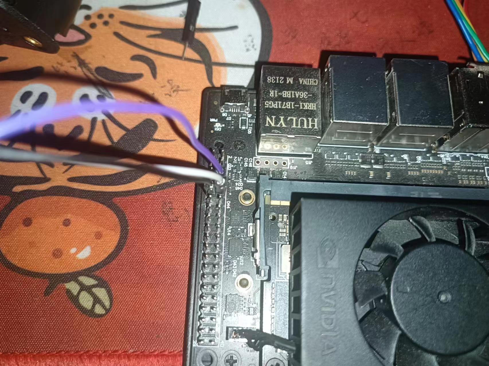

<H1 align="center">


<H1 align="center">

## 安装Miniconda
```
bash Miniconda3-latest-Linux-aarch64.sh 
```
## 运行代码
- 安装依赖
```
Sudo pip install -r requirement.txt

```
-运行代码
```
python Jeston\YOLOv8-DeepSORT-Object-Tracking-main\ultralytics\yolo\v8\detect source=0 show=ture
```
## 装配操作
-Jeston nano连接Pixhawk所需引脚

-6p端子线剪成3p保留RX TX GND

-焊接杜邦线后，RX接TX，TX接RX，GND接GND


##(Jeston nano)安装px4依赖库
```
sudo apt-get install python3-pip
```

